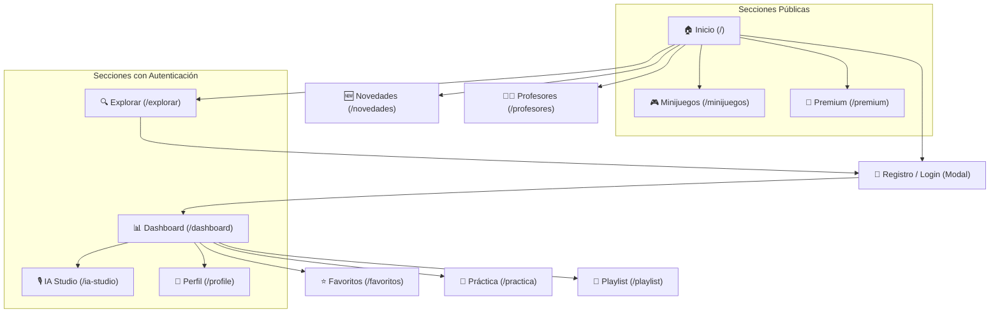

# SmarTune: Auditoría de Look & Feel y Mapa de Navegación

Este documento resume el estado visual actual del proyecto SmarTune, capturado directamente desde el servidor local de desarrollo. 

## 🎨 Look & Feel General
SmarTune utiliza una estética **"Neon Nocturne"** caracterizada por:
- **Modo Oscuro**: Fondos en `#111` y `#181818`.
- **Acentos Neón**: Uso de Rosa Neón (`#f6339a`) y Verde Neón (`#00ffaa`).
- **Glassmorphism**: Paneles con efectos de desenfoque y bordes sutiles.
- **Tipografía**: Fuentes modernas (Inter/Roboto) con jerarquías claras.

## 🧭 Mapa de Navegación

---

## 🖼️ Galería de Módulos

### 1. Inicio (Página Principal)
La puerta de entrada a SmarTune. Presenta un Hero dinámico, instrumentos destacados y lanzamientos recientes.

### 2. IA Studio
Espacio dedicado a la creación y gestión de contenido asistido por IA.

### 3. Minijuegos
Módulo interactivo para practicar teoría musical de forma lúdica.

### 4. Perfil / Ajustes
Gestión de la cuenta del usuario, instrumentos preferidos y configuraciones.

### 5. Premium
Explicación de los beneficios de la suscripción SmarTune.

### 6. Profesores & Novedades (Acceso Protegido)
Estas secciones muestran el "Gatekeeper" que invita al usuario a registrarse para acceder al contenido exclusivo.

---

## 🛠️ Mejoras Realizadas
- **Corrección de Renderizado**: Se solucionó un `TypeError` en `src/app/page.tsx` que ocurría cuando las APIs de estadísticas o lanzamientos fallaban, lo cual bloqueaba la visualización de la Home.
- **Validación de Datos**: Se implementaron comprobaciones de seguridad (`Array.isArray`, optional chaining) para manejar estados de error de manera elegante.

## 🚀 Próximos Pasos Sugeridos
1.  **Uniformidad en Modales**: Asegurar que los modales de "Gatekeeper" sigan exactamente el mismo estilo que el `AuthModal` principal.
2.  **Estados de Carga**: Añadir *skeletons* en las secciones de la Home mientras se cargan los datos de YouTube y Supabase.
3.  **Responsive**: Realizar una auditoría específica para dispositivos móviles.
